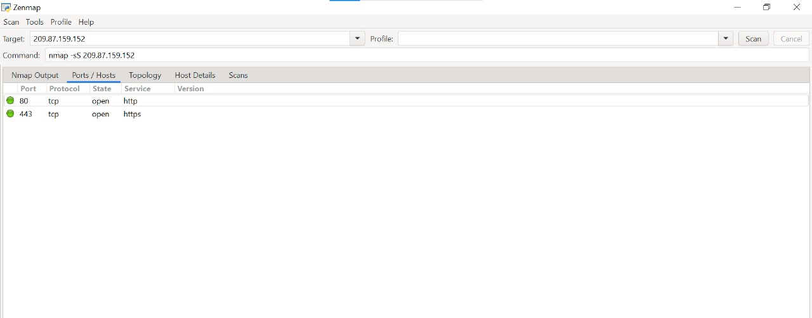

<html>
<head>
  <title>Open ports using nmap</title>
</head>
<body>

<h2 style="background-color: yellow; font-size: 60px; text-align: center;">Finding Open-ports using Nmap</h2> 

<h3 style="text-align: center; font-size: 30px;background-color:red">Nmap Output</h3>

<h5 style="font-size:20px">
  Starting Nmap 7.97 ( https://nmap.org ) at 2025-05-26 17:54 +0530 
  Nmap scan report for 209.87.159.152 
  Host is up (0.00048s latency). 
  Not shown: 992 closed tcp ports (reset) 
  PORT&nbsp;&nbsp;&nbsp;&nbsp;&nbsp;&nbsp;&nbsp;&nbsp;STATE&nbsp;&nbsp;SERVICE 
  80/tcp&nbsp;&nbsp;&nbsp;&nbsp;open&nbsp;&nbsp;http 
  135/tcp&nbsp;&nbsp;open&nbsp;&nbsp;msrpc 
  139/tcp&nbsp;&nbsp;open&nbsp;&nbsp;netbios-ssn 
  445/tcp&nbsp;&nbsp;open&nbsp;&nbsp;microsoft-ds 
  5357/tcp&nbsp;open&nbsp;&nbsp;wsdapi 
  8090/tcp&nbsp;open&nbsp;&nbsp;opsmessaging 
  9999/tcp&nbsp;open&nbsp;&nbsp;abyss 
  16992/tcp open&nbsp;&nbsp;amt-soap-http  
  Nmap done: 1 IP address (1 host up) scanned in 1.12 seconds
</h5>

  

<h3 style="text-align: center; font-size: 40px;background-color:red">Ports/Hosts</h3>
 

</body>
</html>
